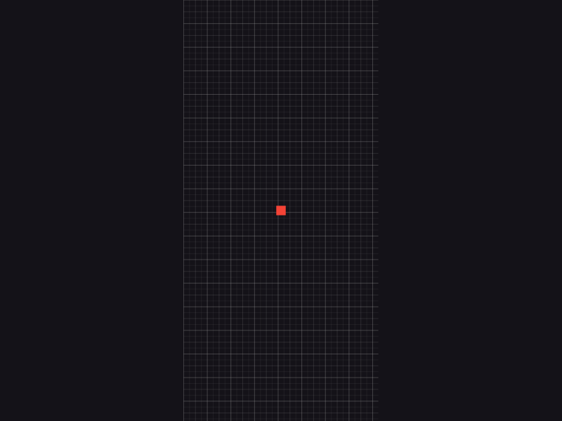
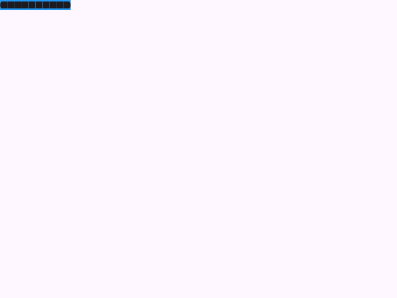

# Examples
## Declaring your test file
First, you need to create a test file with the `_test` suffix in your test folder. You could use something like `test/golden_test.dart`.

Inside it, make sure to call `runWidgetbookGoldenTests` and pass the necessary parameters like the following:

```dart
import 'package:example/widgetbook.directories.g.dart';
import 'package:widgetbook_golden_test/widgetbook_golden_test.dart';

/// Main example with minimum customization.
void main() {
  runWidgetbookGoldenTests(
    nodes: directories,
    properties: WidgetbookGoldenTestsProperties(),
  );
}
```

### Customized WidgetbookGoldenTestsProperties
The `WidgetbookGoldenTestsProperties` allows you to customize the behavior of the golden tests. You can modify the locale, theme, add Widgetbook addons and more. Here is an example of how:

```dart
void main() async {
  // Pre-load assets
  var mySvg = await File("./test/assets/custom.svg").readAsBytes();
  var myJpg =
      await File("./test/assets/custom.jpg").readAsBytes();
  runWidgetbookGoldenTests(
    nodes: directories,
    goldenSnapshotsOutputPath: "./customized/",
    properties: WidgetbookGoldenTestsProperties(
      theme: ThemeData.dark(),
      // Swap un purpose error and loading URLs for testing purposes
      errorImageUrl: "loading-network-image",
      loadingImageUrl: "error-network-image",
      skipTag: "[skip-other]",
      testGroupName: "Widgetbook golden tests with custom properties",
      locale: Locale("es"),
      localizationsDelegates: AppLocalizations.localizationsDelegates,
      supportedLocales: AppLocalizations.supportedLocales,
      addons: [
        ViewportAddon([AndroidViewports.samsungGalaxyA50]),
        GridAddon(),
        AlignmentAddon(initialAlignment: Alignment.center),
        TextScaleAddon(initialScale: 2),
      ],
      networkImageResolver: (uri) {
        if (uri.path.toLowerCase().endsWith(".svg")) {
          return mySvg;
        }
        return myJpg;
      },
    ),
  );
}
```
With all this customization, a snapshot would look like this:

## Use cases

### Red Sized Box
Let's start with a simple case. Given the following use case.
```dart
@widgetbook.UseCase(name: 'Red', type: SizedBox)
Widget buildRedSizedBoxUseCase(BuildContext context) {
  return SizedBox(height: 20, width: 20, child: Container(color: Colors.red));
}
```

**Generated snapshot**


If you are using the customization like the one mentioned in [above](#customized-widgetbookgoldentestsproperties), it will generate this instead:


### Error builder of NetworkImage
Use `WidgetbookGoldenTestsProperties.defaultErrorImageUrl` as the URL of the Image.network widget to generate a snapshot of its errorBuilder.
**Use case code snippet**
```dart
@widgetbook.UseCase(name: 'Error', type: NetworkImage)
Widget buildImageNetworkErrorUseCase(BuildContext context) {
  return Container(
    color: Colors.green,
    child: ClipRRect(
      borderRadius: BorderRadius.circular(20),
      child: Image.network(
        WidgetbookGoldenTestsProperties.defaultErrorImageUrl,
        fit: BoxFit.cover,
        loadingBuilder: (_, child, loadingProgress) {
          return loadingProgress == null ? child : Text("Loading...");
        },
        errorBuilder: (context, error, stackTrace) {
          return const Center(
            child: Text(
              'Error loading image',
              style: TextStyle(color: Colors.red),
            ),
          );
        },
      ),
    ),
  );
}
```

**Generated snapshot**


### Loading builder of NetworkImage
Use `WidgetbookGoldenTestsProperties.defaultLoadingImageUrl` as the URL of the Image.network widget to generate a snapshot of its loadingBuilder.

**Use case code snippet**
```dart
@widgetbook.UseCase(name: 'Loading', type: NetworkImage)
Widget buildImageNetworkLoadingUseCase(BuildContext context) {
  return Container(
    color: Colors.blue,
    child: ClipRRect(
      borderRadius: BorderRadius.circular(20),
      child: Image.network(
        WidgetbookGoldenTestsProperties.defaultLoadingImageUrl,
        fit: BoxFit.cover,
        loadingBuilder: (_, child, loadingProgress) {
          return loadingProgress == null ? child : Text("Loading...");
        },
        errorBuilder: (context, error, stackTrace) {
          return const Center(
            child: Text(
              'Error loading image',
              style: TextStyle(color: Colors.red),
            ),
          );
        },
      ),
    ),
  );
}
```

**Generated snapshot**


### Pop up menu button with tap interaction
Wrap the widget in the use case in a `WidgetbookGoldenTestBuilder`. This will allow you to interact with the widget through the `goldenActions` you add to it before generating the snapshot.

**Use case code snippet**
```dart
@widgetbook.UseCase(name: 'Menu Button', type: PopupMenuButton)
Widget buildPopupMenuButtonUseCase(BuildContext context) {
  return WidgetbookGoldenTestBuilder(
    goldenActions: [
      GoldenPlayAction(
        name: "clicked",
        callback:
            (tester, find) async => tester.tap(find.byType(PopupMenuButton)),
        goldenFinder: (find) => find.byType(MaterialApp).first,
      ),
    ],
    child: PopupMenuButton(
      itemBuilder:
          (context) => [
            PopupMenuItem(child: Text("First option")),
            PopupMenuItem(child: Icon(Icons.share)),
          ],
    ),
  );
}
```

**Generated snapshots**

The previous case will generate the following 2 snapshots, one for its default state and one for the `clicked` golden action:

**Closed**


**Opened**
